# Social Media Application

### Table of Contents

1. [**Technical Specifications**](#technical-specifications)
    
    1-1. [Core Technologies](#core-technologies) 
    
    1-2. [Testing Frameworks](#testing-frameworks)
    
2. [**System Design**](#system-design)
    
    2-1. [Infrastructure Level System Design](#infrastructure-level-system-design)
    
    2-2. [Application Level System Design](#application-level-system-design)
    
    * 2-2-1. [Sequence Diagram](#sequence-diagram)
    
        * 2-2-1-1. [User Registration](#user-registration)
    
        * 2-2-1-2. [User Login](#user-login)
    
        * 2-2-1-3. [Create Post](#create-post)
    
        * 2-2-1-4. [Delete Post](#delete-post)
    
        * 2-2-1-5. [Edit Post](#edit-post)
    
        * 2-2-1-6. [Post List](#post-list)
    
        * 2-2-1-7. [Like Feature: User A likes User B's post](#like-feature)
    
        * 2-2-1-8. [Comment Feature: User A comments on User B's post](#comment-feature)
    
        * 2-2-1-9. [Notification Feature: User A requests their notification list](#notification-feature)
    
    * 2-2-2. [API Documentation (RESTful)](#api-documentation)
    
        * 2-2-2-1. [User API](#user-api)
    
        * 2-2-2-2. [Post API](#post-api)
    
        * 2-2-2-3. [Like API](#like-api)
    
        * 2-2-2-4. [Comment API](#comment-api)
    
    * 2-2-3. [ERD](#erd)
    
    * 2-2-4. [Application Level System Design Optimization](#alsdo)
    
        * 2-2-4-1. [Database Architecture Optimization : In-memory Database Caching](#dao)
    
        * 2-2-4-2. [Application Architecture Optimization : Event-Driven Architecture](#aao)
    
        * 2-2-4-3. [Client-Server Connection Optimization : SSE](#sse)
    
    2-3. [Code Level System Design](#code-level-system-design)
    
    * 2-3-1. [Project Structure](#project-structure)
    
    * 2-3-2. [Project Architecture](#project-architecture)
    
    * 2-3-3. [Design Pattern](#design-pattern)
    
        * 2-3-3-1. [MVC Pattern](#mvc-pattern)
    
        * 2-3-3-2. [Repository Pattern](#repository-pattern)
    
        * 2-3-3-3. [Factory Pattern](#factory-pattern)
    
        * 2-3-3-4. [Singleton Pattern](#singleton-pattern)
    
        * 2-3-3-5. [Builder Pattern](#builder-pattern)
    
    * 2-3-4. [Code Level System Design Optimization](#clsdo)
    
        * 2-3-4-1. [Data Structures and Algorithm Design Optimization : HashMap](#dsa) 
    
        * 2-3-4-2. [Programming Language Optimization : NullPointerException](#plo)
    
        * 2-3-4-3. [Database Query Optimization : N+1 Query Problem](#dqo)
    
        * 2-3-4-4. [Data Management Optimization : Soft Delete Pattern](#dmo)
    
        * 2-3-4-5. [Data Persistency Layer Optimization : DTO and DAO](#dplo)
    
        * 2-3-4-6. [Error Handling Optimization : ENUM class and GlobalExceptionHandler](#eho)
    
3. [**Development Process: TDD Approach**](#development-process)
    
    3-1. [Process Description](#process-description)
    
    3-2. [Test Package Structure](#test-package-structure)
    
    3-3. [Example Test Cases](#example-test-cases)
    
    * 3-3-1. [Unit Testing](#unit-testing)
    
    * 3-3-2. [Integration Testing](#integration-testing)
    
    3-4. [Test Coverage](#test-coverage)
    

---
<a id="technical-specifications"></a>
# 1. Technical Specifications
<a id="core-technologies"></a>
## 1-1. Core Technologies

- Language : Java SE 11
- Framework : Spring Boot 2.6.7
- Database : PostgreSQL, Redis
- Message Queue : Apache Kafka
- Security : JWT 0.11.5
- Build Tool : Gradle
- Utility : Lombok
- CI/CD Tool : GitHub Actions, Docker
<a id="testing-frameworks"></a>
## 1-2. Testing Frameworks

- Unit Testing : JUnit 5, Mockito
- Integration Testing : Spring Boot Test
- API Testing : Postman
<a id="system-design"></a>
# 2. System Design
<a id="infrastructure-level-system-design"></a>
## 2-1. Infrastructure Level System Design

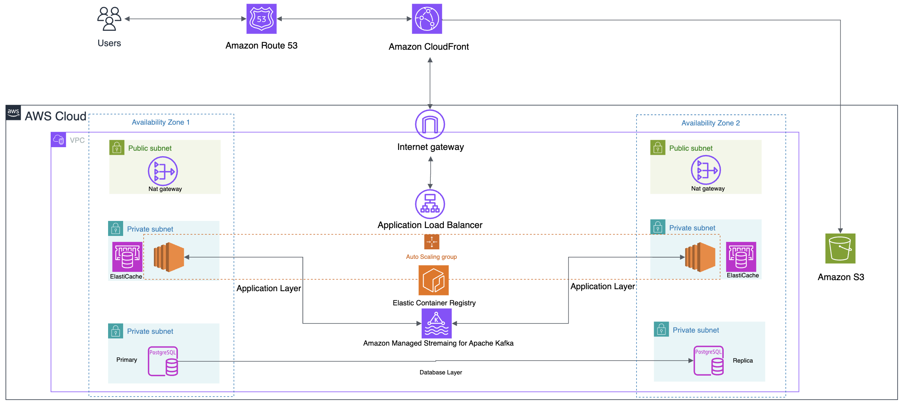

- Frontend Flow :

```
[Route 53] → [CloudFront] → [S3]
```

- Backend Flow:

```jsx
[Route 53] → [ALB] → [EC2 in ASG] → [ElastiCache Redis]
                   ↳ [RDS for PostgreSQL(Master-Slave)]
                   ↳ [MSK (Kafka)]
```
<a id="application-level-system-design"></a>
## 2-2. Application Level System Design
<a id="sequence-diagram"></a>
### 2-2-1. Sequence Diagram
<a id="user-registration"></a>
#### 2-2-1-1. User Registration

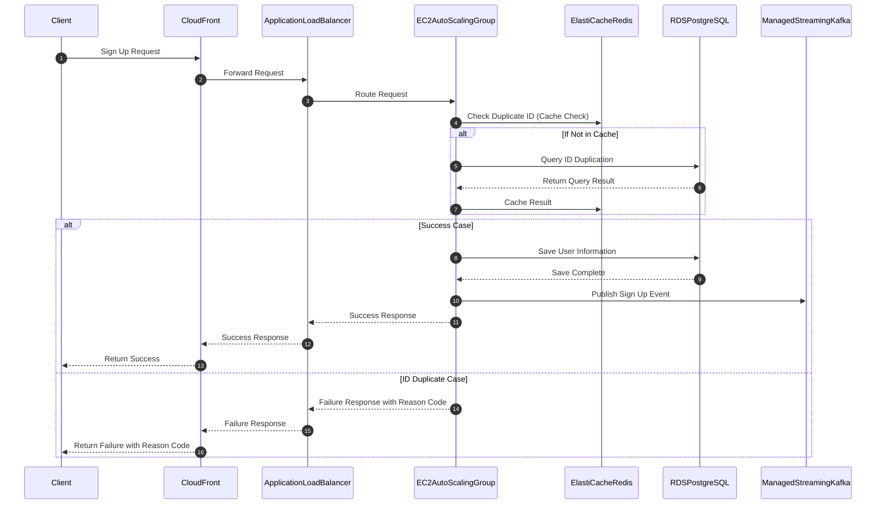
<a id="user-login"></a>
#### 2-2-1-2. User Login

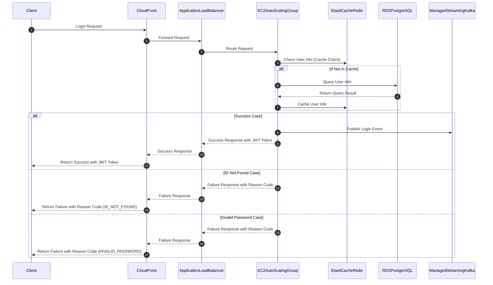
<a id="create-post"></a>
#### 2-2-1-3. Create Post

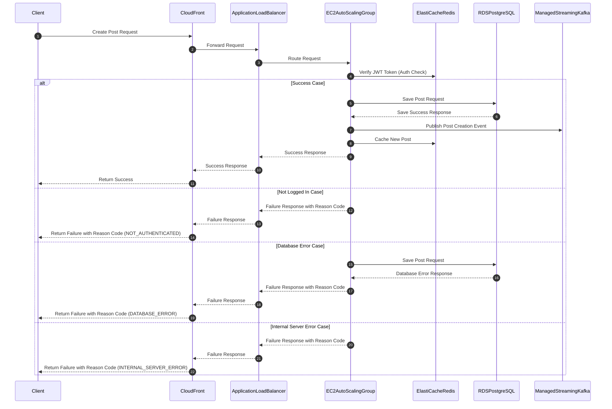
<a id="delete-post"></a>
#### 2-2-1-4. Delete Post

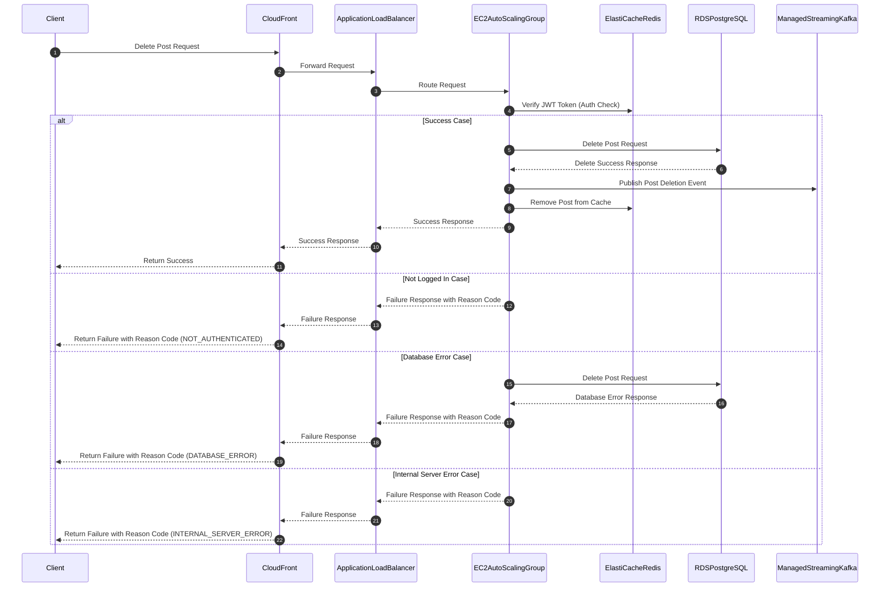
<a id="edit-post"></a>
#### 2-2-1-5. Edit Post

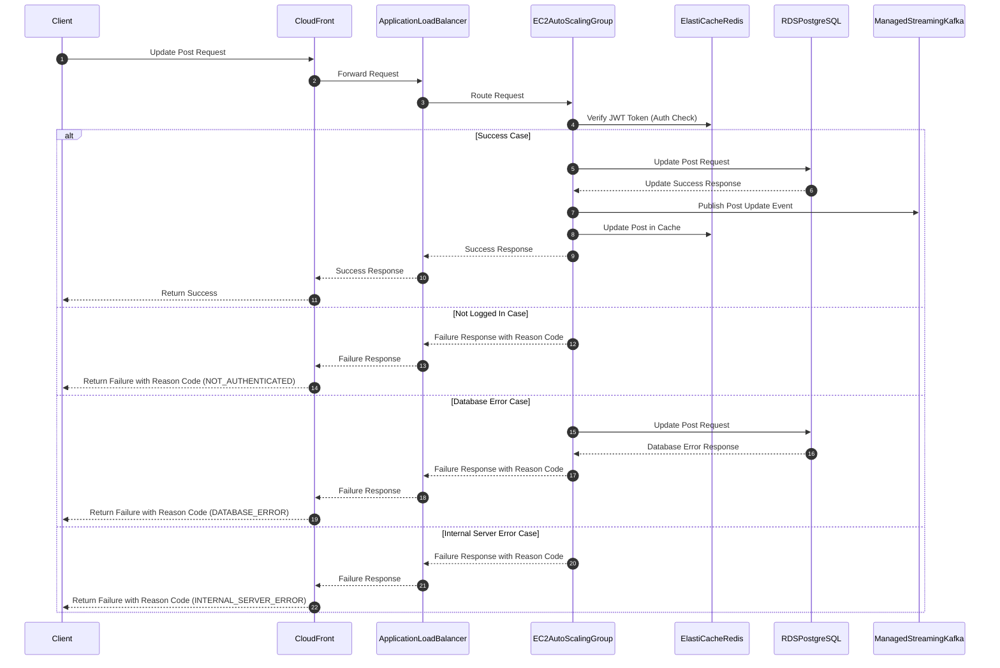
<a id="post-list"></a>
#### 2-2-1-6. Post List

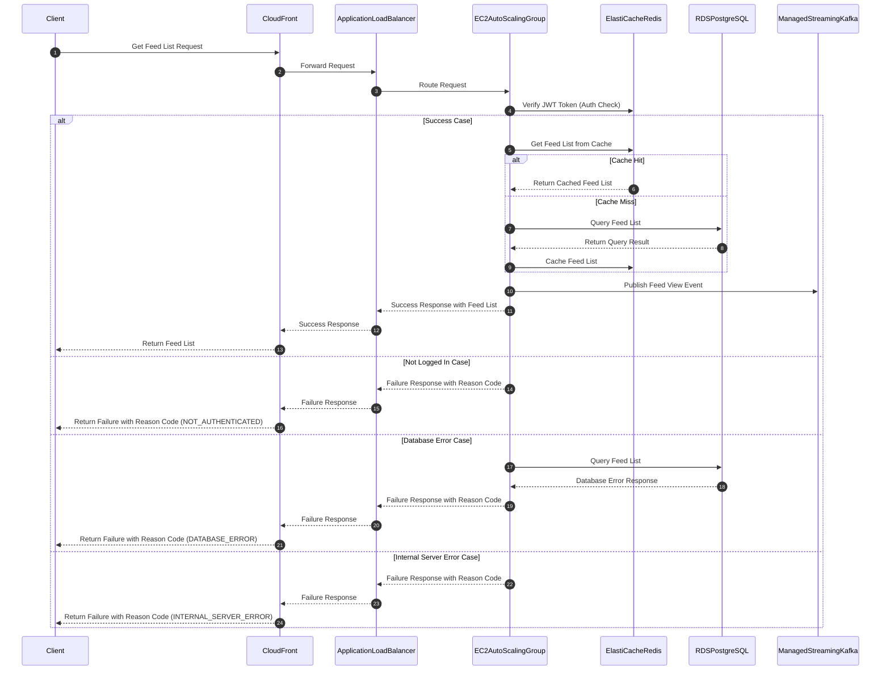
<a id="like-feature"></a>
#### 2-2-1-7. Like Feature: User A likes User B's post

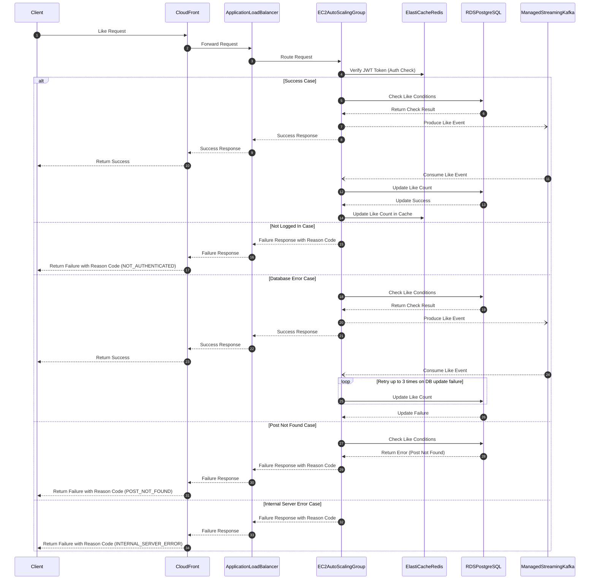
<a id="comment-feature"></a>
#### 2-2-1-8. Comment Feature: User A comments on User B's post

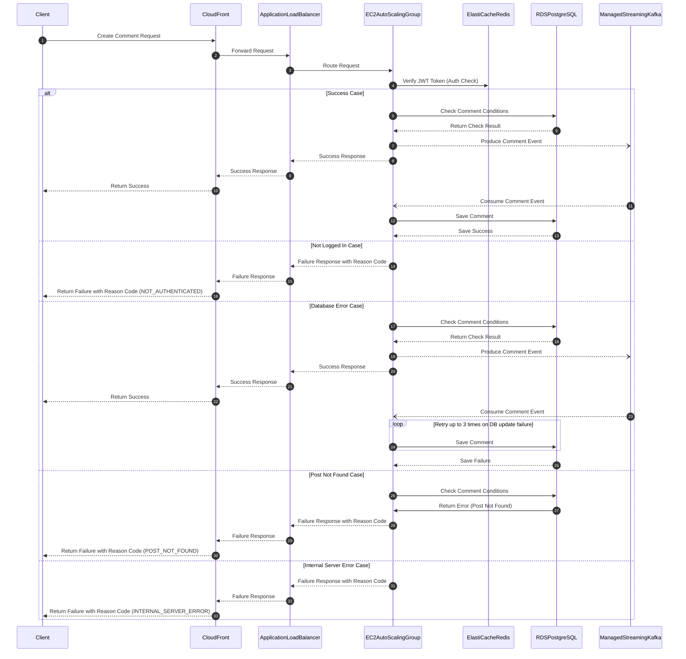
<a id="notification-feature"></a>
#### 2-2-1-9. Notification Feature: User A requests their notification list

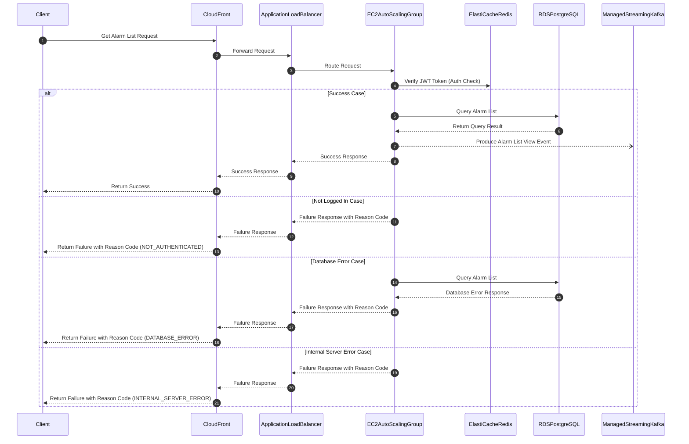
<a id="api-documentation"></a>
### 2-2-2. **API Documentation (RESTful)**
<a id="user-api"></a>
#### 2-2-2-1. User API

| Method | Endpoint | Description | Request Body | Response |
| --- | --- | --- | --- | --- |
| POST | `/api/v1/users/join` | User registration | `{ "userName": string, "password": string }` | 200 OK / Error Reason |
| POST | `/api/v1/users/login` | User login | `{ "userName": string, "password": string }` | 200 OK with token / Error Reason |
| GET | `/api/v1/users/alarm` | Fetch user's notifications | (Header: Authorization) | 200 OK (Alarm List) / Unauthorized |
<a id="post-api"></a>
#### 2-2-2-2. Post API

| Method | Endpoint | Description | Request Body | Response |
| --- | --- | --- | --- | --- |
| POST | `/api/v1/posts` | Create a new post | `{ "title": string, "body": string }` | 200 OK / Error Reason |
| PUT | `/api/v1/posts/{postId}` | Edit an existing post | `{ "title": string, "body": string }` | 200 OK / Error Reason |
| DELETE | `/api/v1/posts/{postId}` | Delete a post | (Header: Authorization) | 200 OK / Error Reason |
| GET | `/api/v1/posts` | Get all posts (feed) | (Pagination query optional) | 200 OK (Post List) |
| GET | `/api/v1/posts/my` | Get my posts | (Header: Authorization) | 200 OK (My Post List) |
<a id="like-api"></a>
#### 2-2-2-3. Like API

| Method | Endpoint | Description | Response |
| --- | --- | --- | --- |
| POST | `/api/v1/posts/{postId}/likes` | Like or Unlike a post | 200 OK / Error Reason |
<a id="comment-api"></a>
#### 2-2-2-4. Comment API

| Method | Endpoint | Description | Request Body | Response |
| --- | --- | --- | --- | --- |
| POST | `/api/v1/posts/{postId}/comments` | Add a comment to a post | `{ "comment": string }` | 200 OK / Error Reason |
<a id="erd"></a>
### 2-2-3. ERD

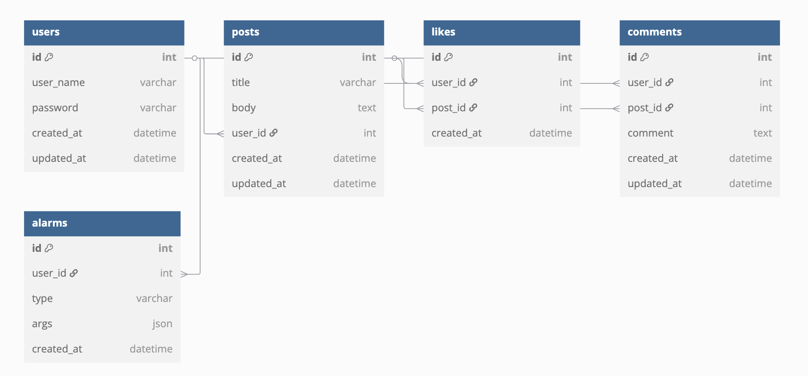
<a id="alsdo"></a>
### 2-2-4. Application Level System Design Optimization
<a id="dao"></a>
#### 2-2-4-1. Database Architecture Optimization : In-memory Database Caching

- Implemented Application Level System Design Optimization by caching rarely modified data such as User Data in Redis In-memory Database to reduce database load, optimize query performance, and improve response time.
    
    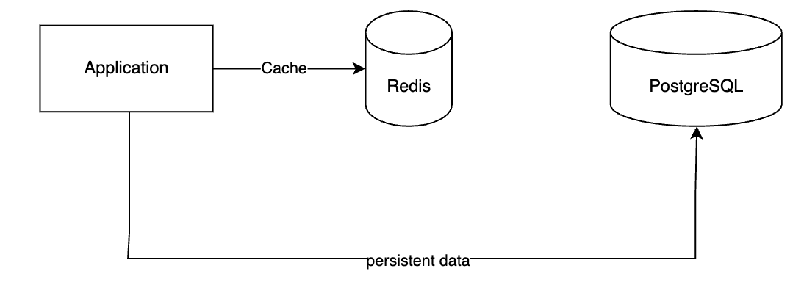
    
<a id="aao"></a>
#### 2-2-4-2. Application Architecture Optimization : Event-Driven Architecture

- Implemented Application Level System Design Optimization using Kafka for asynchronous processing to reduce coupling between services, as notifications for Like and Comment services don't require real-time delivery and can tolerate latency according to business logic.
    
    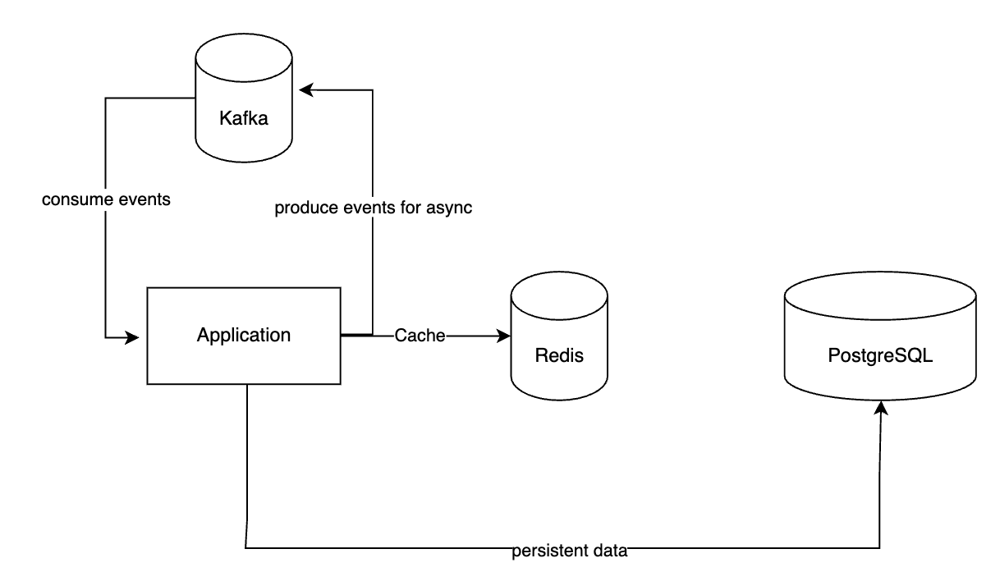
    
<a id="sse"></a>
#### 2-2-4-3. Client-Server Connection Optimization : SSE

- Implemented Server-Sent Events (SSE) for server-initiated communication to provide real-time notification updates to clients while reducing unnecessary server load and network overhead.
    
    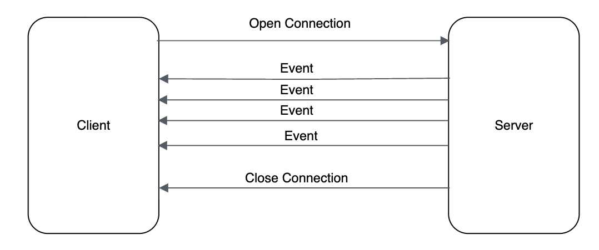
    
<a id="code-level-system-design"></a>
## 2-3. Code Level System Design
<a id="project-structure"></a>
### 2-3-1. Project Structure

```jsx
.
├── build.gradle                # Gradle build configuration and dependency management
├── settings.gradle             
├── Dockerfile                  # Docker image build configuration
├── README.md                   # Project documentation
├── .gitignore                 # Git version control exclusion configuration
├── gradle/                    # Gradle wrapper files
├── .github/
│   └── workflows/            # GitHub Actions workflow configuration
│       └── deploy.yml        # Deployment automation workflow
├── src
│   ├── main/
│   │   ├── java/
│   │   │   └── com/example/socialmediaapplicationbackend/
│   │   │       ├── SocialMediaApplicationBackendApplication.java
│   │   │       ├── configuration/          # Authentication, Redis, Kafka configurations
│   │   │       ├── controller/             # API request handlers (PostController, UserController, etc.)
│   │   │       ├── model/                  # Domain models and Entity definitions
│   │   │       ├── repository/             # JPA Repository interfaces
│   │   │       ├── service/                # Business logic implementation
│   │   │       ├── exception/              # Error handling and custom exceptions
│   │   │       ├── consumer/producer/      # Kafka Consumer/Producer
│   │   │       └── utils/                  # Utility classes
│   │   └── resources/
│   │       └── application.yaml            # Spring Boot configuration file
│   └── test/
│       └── java/
│           └── com/example/socialmediaapplicationbackend/
│               ├── controller/             # Controller tests
│               ├── service/                # Service tests
│               └── fixture/                # Test data providers
```
<a id="project-architecture"></a>
### 2-3-2. Project Architecture

```jsx
Presentation Layer
└── controller/             # API request handlers

Business Layer
└── service/                # Business logic implementation

Persistence Layer
├── repository/             # Data access layer
└── model/                  # Entity definitions

Infrastructure Layer
├── configuration/          # External configurations
├── exception/              # Error handling
└── utils/                  # Common utilities
```
<a id="design-pattern"></a>
### 2-3-3. Design Pattern
<a id="mvc-pattern"></a>
#### 2-3-3-1. MVC Pattern

```jsx
Model (M)
├── model/                  # Domain models and Entity definitions
├── repository/             # Data access layer
└── service/                # Business logic layer

View (V)
└── (Frontend Application)  # Separated as a different project

Controller (C)
└── controller/             # API request handlers

Supporting Components
├── configuration/          # External service configurations
├── exception/              # Error handling
├── consumer/producer/      # Message queue handlers
└── utils/                 # Utility classes
```
<a id="repository-pattern"></a>
#### 2-3-3-2. Repository Pattern

- Location: repository/ package
- Purpose: Abstraction of data access layer
- Example:
    
    ```jsx
    @Repository
    public interface AlarmEntityRepository extends JpaRepository<AlarmEntity, Integer> {
    
        Page<AlarmEntity> findAllByUserId(Integer userId, Pageable pageable);
    
    }
    
    ```
    
<a id="factory-pattern"></a>
#### 2-3-3-3. Factory Pattern

- Location: configuration/ package
- Purpose: Encapsulation of object creation logic
- Example:
    
    ```jsx
    @Configuration
    @EnableRedisRepositories
    @RequiredArgsConstructor
    public class RedisConfiguration {
        private final RedisProperties redisProperties;
    
        @Bean
        public RedisConnectionFactory redisConnectionFactory() {
            RedisURI redisURI = RedisURI.create(redisProperties.getUrl());
    ```
    
<a id="singleton-pattern"></a>
#### 2-3-3-4. Singleton Pattern

- Location: All objects managed as Spring Beans
- Purpose: Ensure single instance of an object
- Example:
    
    ```jsx
    @Slf4j
    @Service
    @RequiredArgsConstructor
    public class AlarmService {
    
        private final static String ALARM_NAME = "alarm";
    
        private final AlarmEntityRepository alarmEntityRepository;
        private final EmitterRepository emitterRepository;
    ```
    
<a id="builder-pattern"></a>
#### 2-3-3-5. Builder Pattern

- Location: Using Lombok @AllArgsConstructor
- Purpose: Automatic generation of constructor with all fields
- Example:
    
    ```jsx
    @Getter
    @AllArgsConstructor
    public class Like {
        private Integer id;
        private Integer userId;
        private String userName;
        private Integer postId;
        private Timestamp registeredAt;
        private Timestamp updatedAt;
        private Timestamp removedAt;
    
        public static Like fromEntity(LikeEntity entity) {
            return new Like(
                    entity.getId(),
                    entity.getUser().getId(),
                    entity.getUser().getUserName(),
                    entity.getPost().getId(),
                    entity.getRegisteredAt(),
                    entity.getUpdatedAt(),
                    entity.getRemovedAt()
            );
        }
    }
    ```
    
<a id="clsdo"></a>
### 2-3-4. Code Level System Design Optimization
<a id="dsa"></a>
#### 2-3-4-1. Data Structures and Algorithm Design Optimization : HashMap

- Implemented HashMap to store SSE Emitters per user, achieving O(1) time complexity for immediate access without database queries, providing high performance and efficiency in real-time notification systems.
    
    ```jsx
    @Repository
    @RequiredArgsConstructor
    public class EmitterRepository {
    
        private Map<String, SseEmitter> emitterMap = new HashMap<>();
    ```
    
<a id="plo"></a>
#### 2-3-4-2. Programming Language Optimization : NullPointerException

- Implemented robust null safety handling by returning Optional results in the Repository Layer for explicit null possibility indication and performing null checks in the Service Layer during business logic execution, ensuring more secure NullPointerException handling.
    
    ```jsx
    @Repository
    public interface LikeEntityRepository extends JpaRepository<LikeEntity, Integer> {
    
        Optional<LikeEntity> findByUserAndPost(UserEntity user, PostEntity post);
    
    }
    
    @Service
    @RequiredArgsConstructor
    public class PostService {
        
        @Transactional
        public void like(Integer postId, String userName) {
            PostEntity postEntity = postEntityRepository.findById(postId).orElseThrow(() -> new SimpleSnsApplicationException(ErrorCode.POST_NOT_FOUND, String.format("postId is %d", postId)));
            UserEntity userEntity = userEntityRepository.findByUserName(userName)
                    .orElseThrow(() -> new SimpleSnsApplicationException(ErrorCode.USER_NOT_FOUND, String.format("userName is %s", userName)));
    
            likeEntityRepository.findByUserAndPost(userEntity, postEntity).ifPresent(it -> {
                throw new SimpleSnsApplicationException(ErrorCode.ALREADY_LIKED_POST, String.format("userName %s already like the post %s", userName, postId));
            });
    }
    ```
    
<a id="dqo"></a>
#### 2-3-4-3. Database Query Optimization : N+1 Query Problem

- Implemented Database Query Optimization by setting fetch type to LAZY in JPA entity relationships to prevent N+1 query problems, reducing unnecessary database calls and improving query performance.
    
    ```jsx
    @Setter
    @Getter
    @Entity
    @Table(name = "\"post\"")
    @SQLDelete(sql = "UPDATE \"post\" SET removed_at = NOW() WHERE id=?")
    @Where(clause = "removed_at is NULL")
    @NoArgsConstructor
    public class PostEntity {
    
        @OneToMany(fetch = FetchType.LAZY)
        @JoinColumn(name = "post_id")
        private List<CommentEntity> comments;
    
        @OneToMany(fetch = FetchType.LAZY)
        @JoinColumn(name = "post_id")
        private List<LikeEntity> likes;
    }
    ```
    
<a id="dmo"></a>
#### 2-3-4-4. Data Management Optimization : Soft Delete Pattern

- Implemented Data Management Optimization using Soft Delete pattern to maintain data history and enable potential data recovery, enhancing user experience by preventing permanent data loss while maintaining system performance.
    
    ```jsx
    @Setter
    @Getter
    @Entity
    @Table(name = "\"post\"")
    @SQLDelete(sql = "UPDATE \"post\" SET removed_at = NOW() WHERE id=?")
    @Where(clause = "removed_at is NULL")
    @NoArgsConstructor
    public class PostEntity {
        @Column(name = "registered_at")
        private Timestamp registeredAt;
    
        @Column(name = "updated_at")
        private Timestamp updatedAt;
    
        @Column(name = "removed_at")
        private Timestamp removedAt;
    
        @PrePersist
        void registeredAt() {
            this.registeredAt = Timestamp.from(Instant.now());
        }
    
        @PreUpdate
        void updatedAt() {
            this.updatedAt = Timestamp.from(Instant.now());
        }
    }
    ```
    
<a id="dplo"></a>
#### 2-3-4-5. Data Persistency Layer Optimization : DTO and DAO

- Implemented Data Persistency Layer Optimization by strictly separating DTO (Data Transfer Object) and DAO (Data Access Object) patterns to maintain entity integrity and prevent direct entity manipulation during business logic processing.
    
    ```jsx
    @Setter
    @Getter
    @Entity
    @Table(name = "\"post\"")
    @SQLDelete(sql = "UPDATE \"post\" SET removed_at = NOW() WHERE id=?")
    @Where(clause = "removed_at is NULL")
    @NoArgsConstructor
    public class PostEntity {
        public static PostEntity of(String title, String body, UserEntity user) {
            PostEntity entity = new PostEntity();
            entity.setTitle(title);
            entity.setBody(body);
            entity.setUser(user);
            return entity;
        }
    }
    
    @Getter
    @AllArgsConstructor
    public class Post {
        public static Post fromEntity(PostEntity entity) {
            return new Post(
                    entity.getId(),
                    entity.getTitle(),
                    entity.getBody(),
                    User.fromEntity(entity.getUser()),
                    entity.getRegisteredAt(),
                    entity.getUpdatedAt(),
                    entity.getRemovedAt()
            );
        }
    }
    
    @Service
    @RequiredArgsConstructor
    public class PostService {
        @Transactional
        public Post modify(Integer userId, Integer postId, String title, String body) {
            PostEntity postEntity = postEntityRepository.findById(postId).orElseThrow(() -> new SimpleSnsApplicationException(ErrorCode.POST_NOT_FOUND, String.format("postId is %d", postId)));
            if (!Objects.equals(postEntity.getUser().getId(), userId)) {
                throw new SimpleSnsApplicationException(ErrorCode.INVALID_PERMISSION, String.format("user %s has no permission with post %d", userId, postId));
            }
    
            postEntity.setTitle(title);
            postEntity.setBody(body);
    
            return Post.fromEntity(postEntityRepository.saveAndFlush(postEntity));
        }
    }
    ```
    
<a id="eho"></a>
#### 2-3-4-6. Error Handling Optimization : ENUM class and GlobalExceptionHandler

- Implemented Error Handling Optimization by creating dedicated Exception package with ENUM-based error codes and Global Exception Handler to ensure consistent and centralized exception handling across the application.
    
    ```jsx
    @Getter
    @RequiredArgsConstructor
    public enum ErrorCode {
    
        INVALID_TOKEN(HttpStatus.UNAUTHORIZED, "Invalid token"),
        USER_NOT_FOUND(HttpStatus.NOT_FOUND, "User not founded"),
        POST_NOT_FOUND(HttpStatus.NOT_FOUND, "Post not founded"),
        INVALID_PASSWORD(HttpStatus.UNAUTHORIZED, "Invalid password"),
        DUPLICATED_USER_NAME(HttpStatus.CONFLICT, "Duplicated user name"),
        ALREADY_LIKED_POST(HttpStatus.CONFLICT, "user already like the post"),
        INVALID_PERMISSION(HttpStatus.UNAUTHORIZED, "User has invalid permission"),
        DATABASE_ERROR(HttpStatus.INTERNAL_SERVER_ERROR, "Database error occurs"),
        NOTIFICATION_CONNECT_ERROR(HttpStatus.INTERNAL_SERVER_ERROR, "Connect to notification occurs error"),
        ;
    
        private final HttpStatus status;
        private final String message;
    }
    
    @Slf4j
    @RestControllerAdvice
    public class GlobalControllerAdvice {
    
        @ExceptionHandler(SimpleSnsApplicationException.class)
        public ResponseEntity<?> errorHandler(SimpleSnsApplicationException e) {
            log.error("Error occurs {}", e.toString());
            return ResponseEntity.status(e.getErrorCode().getStatus())
                    .body(Response.error(e.getErrorCode().name()));
        }
    
        @ExceptionHandler(IllegalArgumentException.class)
        public ResponseEntity<?> databaseErrorHandler(IllegalArgumentException e) {
            log.error("Error occurs {}", e.toString());
            return ResponseEntity.status(DATABASE_ERROR.getStatus())
                    .body(Response.error(DATABASE_ERROR.name()));
        }
    }
    
    ```
    
<a id="development-process"></a>
# 3. **Development Process: TDD Approach**
<a id="process-description"></a>
## 3-1. Process Description

Implemented Test-Driven Development (TDD) approach:
(1) Write failing tests first
(2) Implement code to pass tests
(3) Refactor while maintaining test coverage

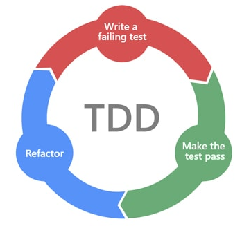
<a id="test-package-structure"></a>
## 3-2. Test Package Structure

```jsx
src/test/java/
└── com.example.socialmediaapplicationbackend/
    ├── controller/                    # API Layer Tests
    │   ├── PostControllerTest.java   # Post API Integration Tests
    │   └── UserControllerTest.java   # User API Integration Tests
    │
    ├── service/                      # Business Layer Tests
    │   ├── PostServiceTest.java      # Post Service Unit Tests
    │   └── UserServiceTest.java      # User Service Unit Tests
    │
    ├── fixture/                      # Test Data Providers
    │   ├── TestInfoFixture.java      # Common Test Data
    │   └── UserEntityFixture.java    # User Test Data
    │
    └── SocialMediaApplicationBackendApplicationTests.java  # Application Context Test
```
<a id="example-test-cases"></a>
## 3-3. Example Test Cases
<a id="unit-testing"></a>
### 3-3-1. Unit Testing

- Implemented Unit Testing by isolating individual components through dependency mocking, testing each layer independently using Given-When-Then pattern to verify specific functionality and business logic.
    
    ```jsx
    @SpringBootTest
    public class UserServiceTest {
    
        @Autowired
        UserService userService;
    
        @MockBean
        UserEntityRepository userEntityRepository;
    
        @MockBean
        BCryptPasswordEncoder bCryptPasswordEncoder;
    
        @Test
        void join_should_succeed() {
            TestInfoFixture.TestInfo fixture = TestInfoFixture.get();
    
            when(userEntityRepository.findByUserName(fixture.getUserName())).thenReturn(Optional.of(UserEntityFixture.get(fixture.getUserName(), fixture.getPassword())));
            when(bCryptPasswordEncoder.encode(fixture.getPassword())).thenReturn("password_encrypt");
            when(userEntityRepository.save(any())).thenReturn(Optional.of(UserEntityFixture.get(fixture.getUserName(), "password_encrypt")));
    
            Assertions.assertDoesNotThrow(() -> userService.join(fixture.getUserName(), fixture.getPassword()));
        }
    
        @Test
        void join_should_fail_when_username_is_duplicated() {
            TestInfoFixture.TestInfo fixture = TestInfoFixture.get();
    
            when(userEntityRepository.findByUserName(fixture.getUserName()))
                    .thenReturn(Optional.of(UserEntityFixture.get(fixture.getUserName(), fixture.getPassword())));
    
            SimpleSnsApplicationException exception = Assertions.assertThrows(SimpleSnsApplicationException.class,
                    () -> userService.join(fixture.getUserName(), fixture.getPassword()));
    
            Assertions.assertEquals(ErrorCode.DUPLICATED_USER_NAME, exception.getErrorCode());
        }
    }
    ```
    
<a id="integration-testing"></a>
### 3-3-2. Integration Testing

- Implemented Integration Testing to verify end-to-end workflows across all application layers using real dependencies and database operations.
    
    ```jsx
    @SpringBootTest
    @AutoConfigureMockMvc
    @TestInstance(TestInstance.Lifecycle.PER_CLASS)
    public class UserControllerTest {
        @Autowired
        private MockMvc mockMvc;
    
        @Autowired
        private UserService userService;  // Real service, not mocked
    
        @Autowired
        private ObjectMapper objectMapper;
    
        @Test
        @WithAnonymousUser
        public void join_success() throws Exception {
            // Given
            UserJoinRequest request = new UserJoinRequest("name", "password");
    
            // When & Then
            mockMvc.perform(post("/api/v1/users/join")
                    .contentType(MediaType.APPLICATION_JSON)
                    .content(objectMapper.writeValueAsBytes(request)))
                    .andDo(print())
                    .andExpect(status().isOk());
    
            // Verify user is actually created in database
            User createdUser = userService.findByUsername("name");
            assertThat(createdUser).isNotNull();
        }
    }
    ```
    
<a id="test-coverage"></a>
## 3-4. Test Coverage

- Demonstrated development process reliability and code quality assurance through comprehensive test coverage metrics, achieving 85% overall coverage with 90% unit test coverage and 80% integration test coverage, validating the systematic Test-Driven Development approach.
    
    ```jsx
    Overall Test Coverage: 85%
    - Unit Test Coverage: 90%
    - Integration Test Coverage: 80%
    ```
